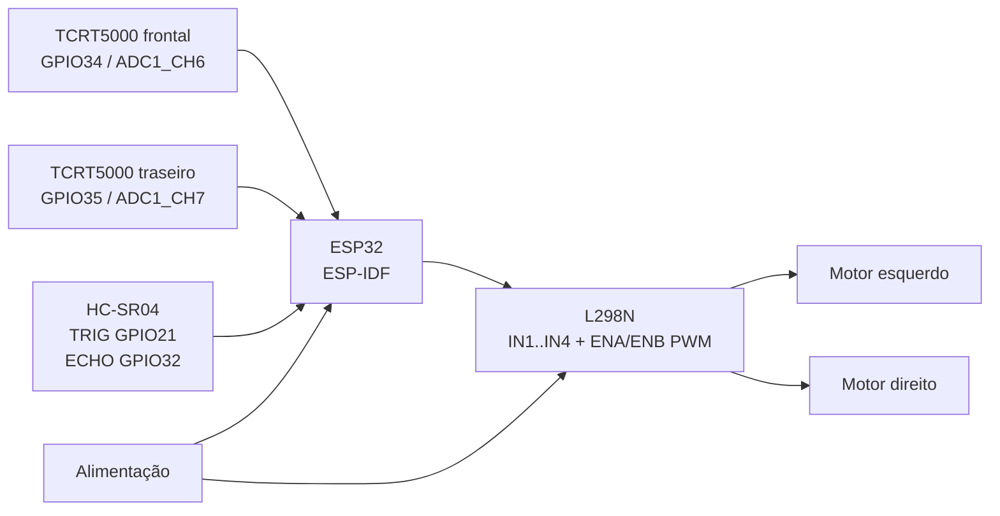

# ESP32 Sumo Robot 🤖


Academic ESP32 sumo robot developed with PlatformIO and ESP-IDF, featuring ultrasonic opponent detection, edge sensing, PWM motor control via L298N, and autonomous behavior logic.

Este repositório organiza e documenta um projeto acadêmico já desenvolvido anteriormente em contexto universitário. A publicação atual tem foco em portfólio técnico: o firmware foi organizado em uma estrutura PlatformIO + ESP-IDF, preservando a lógica principal desenvolvida no protótipo acadêmico e acompanhado de documentação para leitura, reprodução e manutenção.

## Autoria

| Papel | Informação |
| --- | --- |
| Autor e mantenedor | Rafael Ryan Ramos de Souza / [Soturine](https://github.com/Soturine) |
| Contexto | Projeto desenvolvido em contexto acadêmico |
| Publicação | Organização técnica para portfólio no GitHub |

## Status do Projeto

Projeto acadêmico concluído e atualmente documentado para publicação no GitHub.

O protótipo físico e a lógica principal já existiam antes desta organização do repositório. Nesta etapa, foram feitos apenas ajustes seguros de nomenclatura, comentários e logs para alinhar o código ao comportamento real de um robô sumô autônomo.

## Contexto Acadêmico

Este projeto foi desenvolvido como uma aplicação prática de robótica móvel e sistemas embarcados em ambiente acadêmico. A proposta combina montagem física, eletrônica básica, leitura de sensores, acionamento de motores e tomada de decisão autônoma em um protótipo de robô sumô.

A documentação atual não apresenta resultados de competição, colocação, métricas de desempenho ou medições experimentais que não estejam presentes no material original. O foco deste repositório é registrar a arquitetura, a lógica de controle e os aprendizados técnicos do projeto já realizado.

## Objetivo

Construir e controlar um robô sumô autônomo capaz de:

- detectar bordas/linha branca da arena com sensores TCRT5000;
- medir a distância de um oponente com sensor ultrassônico HC-SR04;
- priorizar ações de segurança para evitar sair da arena;
- avançar contra o alvo quando ele estiver dentro do limite configurado;
- girar sobre o próprio eixo para procurar oponente quando nenhum alvo for detectado;
- controlar motores DC por ponte H L298N com PWM via LEDC do ESP32.

O projeto explora eletrônica embarcada, robótica móvel, controle discreto, integração de sensores, atuação por ponte H, testes práticos e iterações de calibração em um protótipo físico.

## Features

- Firmware em C usando `app_main()` no padrão ESP-IDF.
- Leitura analógica dos sensores TCRT5000 por ADC1.
- Média simples de amostras ADC para reduzir ruído.
- Histerese para estabilizar a detecção de borda.
- Medição do HC-SR04 em milímetros com timeout.
- Controle de dois motores por L298N.
- PWM nos pinos ENA/ENB usando LEDC.
- Modos de movimento: parar, avançar, recuar e girar em torno do próprio eixo.
- Máquina de decisão por prioridade, adequada para robô sumô.

## Tecnologias

| Camada | Tecnologia |
| --- | --- |
| Microcontrolador | ESP32 DevKit / ESP32 WROOM |
| Framework | ESP-IDF |
| Ambiente | PlatformIO |
| Linguagem | C |
| RTOS | FreeRTOS, via ESP-IDF |
| GPIO | `driver/gpio.h` |
| ADC | `driver/adc.h` |
| PWM | LEDC, via `driver/ledc.h` |

## Hardware Utilizado

A montagem física pode variar conforme a versão do protótipo, mas o firmware documentado foi estruturado para uma base típica de robótica acadêmica com:

- ESP32 WROOM / DevKit, versão 38 pinos;
- sensor ultrassônico HC-SR04 ou HC-SR04P;
- 2 sensores reflexivos TCRT5000;
- ponte H L298N;
- 2 motores DC N20 com rodas;
- chassi/base para robô móvel;
- alimentação para motores e ESP32;
- chave liga/desliga, fios jumper, protoboard ou conexões equivalentes.

Veja a lista detalhada em [docs/materials.md](docs/materials.md).

## Arquitetura Geral



O ESP32 lê os sensores de borda, mede a distância pelo ultrassônico e aciona a ponte H. Os sensores de borda têm prioridade sobre a estratégia de ataque, pois em um robô sumô a primeira regra é evitar sair da arena.

## Lógica de Funcionamento

O loop principal executa uma decisão por prioridade:

| Prioridade | Condição | Ação |
| --- | --- | --- |
| 1 | sensor frontal e traseiro detectam branco | parar |
| 2 | sensor frontal detecta branco | recuar com PWM médio |
| 3 | sensor traseiro detecta branco | avançar com PWM médio |
| 4 | ultrassônico mede alvo a `<= 150 mm` | avançar com PWM máximo |
| 5 | nenhum sensor detecta branco e não há alvo próximo | girar procurando oponente |

O limite de ataque do firmware é `150 mm`, ou seja, **15 cm**. A distância do HC-SR04 é calculada em milímetros.

### Sensores TCRT5000

O código usa ADC de 12 bits, com leituras brutas de `0` a `4095`. Nesta calibração do firmware:

- valor ADC `<= 1750` marca o sensor como branco/borda;
- valor ADC `>= 2000` libera o estado de branco;
- valores entre `1750` e `2000` mantêm o estado anterior, criando histerese.

Essa interpretação depende do módulo TCRT5000, altura do sensor, iluminação e contraste da arena. Se a montagem física responder ao contrário, ajuste os thresholds ou a lógica de calibração com cuidado.

Uma explicação mais detalhada está em [docs/logic.md](docs/logic.md).

## Tabela de Pinos

| Função | GPIO ESP32 | Observações |
| --- | --- | --- |
| L298N IN1 | GPIO16 | Direção do motor esquerdo |
| L298N IN2 | GPIO17 | Direção do motor esquerdo |
| L298N IN3 | GPIO18 | Direção do motor direito |
| L298N IN4 | GPIO19 | Direção do motor direito |
| TCRT frontal | GPIO34 / ADC1_CH6 | Entrada analógica; GPIO34 é somente entrada |
| TCRT traseiro | GPIO35 / ADC1_CH7 | Entrada analógica; GPIO35 é somente entrada |
| HC-SR04 TRIG | GPIO21 | Saída digital |
| HC-SR04 ECHO | GPIO32 | Entrada digital; usar adaptação de nível se ECHO estiver em 5 V |
| L298N ENA | GPIO22 / LEDC CH0 | PWM do motor A; remover jumper ENA |
| L298N ENB | GPIO23 / LEDC CH1 | PWM do motor B; remover jumper ENB |

Detalhes de ligação e cuidados elétricos estão em [docs/wiring.md](docs/wiring.md).

## Estrutura do Repositório

```text
.
├── assets/
│   └── images/
│       └── README.md
├── docs/
│   ├── logic.md
│   ├── materials.md
│   ├── troubleshooting.md
│   └── wiring.md
├── src/
│   └── main.c
├── .gitignore
├── CHANGELOG.md
├── LICENSE
├── README.md
└── platformio.ini
```

## Como Reproduzir

### Pré-requisitos

- Visual Studio Code;
- extensão PlatformIO;
- placa ESP32 Dev Module;
- cabo USB com dados;
- montagem eletrônica seguindo a pinagem do projeto.

### Compilar

```bash
pio run
```

### Gravar no ESP32

```bash
pio run --target upload
```

Se o upload falhar, pressione o botão `BOOT` do ESP32 durante o início da gravação, dependendo da placa.

### Monitorar pela Serial

```bash
pio device monitor
```

Velocidade configurada no projeto: `115200`.

## Demonstração

Esta seção está preparada para receber registros reais do projeto. Ao adicionar mídias, prefira fotos e vídeos do protótipo físico, da arena e da fiação usada na montagem, evitando imagens genéricas que não representem o robô documentado neste repositório.

| Mídia | Status | Onde adicionar |
| --- | --- | --- |
| Vídeo no YouTube | pendente | Adicionar aqui o link público do vídeo real do robô |
| GIF curto | pendente | `assets/images/demo.gif` |
| Foto frontal do protótipo | pendente | `assets/images/robot-front.jpg` |
| Foto superior do protótipo | pendente | `assets/images/robot-top.jpg` |
| Foto da arena de testes | pendente | `assets/images/arena-test.jpg` |
| Foto da fiação/montagem | pendente | `assets/images/wiring-photo.jpg` |
| Diagrama de ligação | pendente | `assets/images/wiring-diagram.png` |

Sugestão para atualização futura:

```markdown
Vídeo: https://www.youtube.com/watch?v=SEU_VIDEO_AQUI


```

O arquivo [assets/images/README.md](assets/images/README.md) documenta esses placeholders.

## Cuidados de Montagem

- Todos os módulos devem compartilhar GND comum: ESP32, L298N, sensores e fonte dos motores.
- Os GPIOs do ESP32 não são tolerantes a 5 V.
- O ECHO do HC-SR04 comum pode sair em 5 V; use divisor de tensão ou adaptação de nível para proteger o GPIO32.
- Para usar PWM nos pinos ENA/ENB da L298N, remova os jumpers de enable da placa.
- Motores podem girar invertidos dependendo da ligação física; ajuste fios ou lógica com testes controlados.
- Sensores TCRT5000 precisam de calibração conforme arena, distância do chão e iluminação.

## Desafios e Aprendizados Práticos

Além da lógica de controle, o projeto envolve uma parte importante de ajuste físico e elétrico. Em robótica móvel, pequenas diferenças de montagem podem mudar bastante o comportamento do protótipo.

Principais desafios práticos coerentes com esta versão do firmware:

- calibrar os sensores TCRT5000 para distinguir a borda branca da arena;
- ajustar os thresholds ADC de acordo com iluminação, altura dos sensores e contraste da superfície;
- manter GND comum entre ESP32, L298N, sensores e alimentação dos motores;
- lidar com queda de tensão e ruído quando os motores entram em movimento;
- proteger o GPIO do ESP32 caso o ECHO do HC-SR04 esteja em 5 V;
- ajustar PWM, torque e velocidade para evitar respostas bruscas ou fracas demais;
- conferir o sentido físico dos motores, que pode inverter conforme a ligação na ponte H;
- testar a estabilidade do robô na arena antes de aumentar a potência dos motores.

Esses pontos reforçam que o comportamento final não depende apenas do código: a montagem, a alimentação e a calibração influenciam diretamente a resposta do robô.

## Possíveis Melhorias Futuras

- Adicionar rotina de calibração dos sensores TCRT5000 antes da luta.
- Registrar leituras no monitor serial em formato mais compacto para facilitar ajuste de threshold.
- Separar drivers de motor, sensores e lógica em módulos C dedicados.
- Adicionar controle de velocidade independente para cada motor.
- Implementar estratégia de busca com variação temporal em vez de giro fixo.
- Criar diagrama elétrico visual completo.
- Adicionar fotos reais, vídeo de demonstração e detalhes mecânicos do chassi.

Essas melhorias não foram implementadas nesta publicação para preservar a essência do firmware original.

## Troubleshooting

Problemas comuns de montagem, upload e calibração estão em [docs/troubleshooting.md](docs/troubleshooting.md).

Alguns pontos críticos:

- ECHO do HC-SR04 em 5 V pode danificar o ESP32.
- Threshold ADC mal calibrado pode fazer o robô sair da arena.
- Jumpers ENA/ENB na L298N podem impedir o controle PWM pelo ESP32.
- Queda de tensão ao ligar motores pode reiniciar a placa.

## Aprendizados

Este projeto consolidou conhecimentos práticos em:

- firmware embarcado em C com ESP-IDF;
- integração entre sensores digitais/analógicos e atuadores;
- uso de ADC, GPIO, timers e PWM no ESP32;
- lógica de prioridade para robôs autônomos;
- cuidados elétricos em sistemas com motores DC;
- documentação técnica de projeto acadêmico para portfólio.

## Evolução do Projeto

Este robô sumô é conceitualmente relacionado ao projeto [ESP32 Line Follower Robot](https://github.com/Soturine/esp32-line-follower-robot).

Os dois projetos representam variações acadêmicas de uma plataforma robótica semelhante, baseada em ESP32, ponte H, motores DC e sensores. O robô segue linha foca em navegação por pista; este repositório documenta exclusivamente a versão **robô sumô**, com detecção de borda, busca de oponente e ataque por ultrassônico.

Não há integração direta entre os repositórios e nenhum código do projeto segue linha foi copiado para este projeto.

## Sobre o Projeto

Este repositório foi preparado como publicação técnica de portfólio a partir de um projeto acadêmico já realizado. A intenção é preservar a lógica desenvolvida, organizar o material em uma estrutura reproduzível e apresentar de forma clara os aprendizados de robótica, eletrônica e software embarcado envolvidos no protótipo.

## Licença

Distribuído sob a licença MIT. Veja [LICENSE](LICENSE) para mais detalhes.
