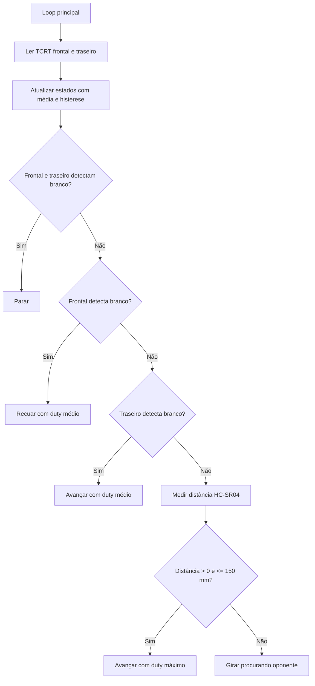

# Logic

Este documento explica o algoritmo implementado em `src/main.c`.

## Visão Geral

O robô executa um loop de controle simples:

1. lê os dois sensores TCRT5000 por ADC;
2. atualiza o estado de detecção de borda usando média e histerese;
3. aplica uma tabela de prioridades;
4. mede o ultrassônico apenas se a borda não foi detectada;
5. aciona os motores pela ponte H L298N usando PWM nos enables.

## Fluxo de Decisão



## Tabela de Decisão

| Sensor frontal | Sensor traseiro | Ultrassônico | Ação |
| --- | --- | --- | --- |
| branco | branco | não consultado | parar |
| branco | não branco | não consultado | recuar |
| não branco | branco | não consultado | avançar |
| não branco | não branco | alvo até 150 mm | avançar com duty máximo |
| não branco | não branco | sem alvo no limite | girar em torno do próprio eixo |

Os sensores de borda têm prioridade sobre o ataque. Isso evita que o robô continue avançando contra o oponente se estiver próximo de sair da arena.

## TCRT5000 por ADC

O firmware usa:

- `ADC1_CH6` para o sensor frontal, ligado ao `GPIO34`;
- `ADC1_CH7` para o sensor traseiro, ligado ao `GPIO35`;
- largura ADC de 12 bits;
- atenuação `ADC_ATTEN_DB_11`;
- média de `4` amostras por sensor;
- intervalo de `100 us` entre amostras.

Nesta versão do código, a interpretação calibrada é:

| Leitura ADC | Estado usado pelo firmware |
| --- | --- |
| `<= 1750` | branco/borda detectado |
| `1751` a `1999` | mantém o estado anterior |
| `>= 2000` | branco/borda liberado |

Essa faixa intermediária é a histerese. Ela reduz oscilações quando a leitura fica próxima do threshold.

> Observação: em módulos TCRT5000 diferentes, a relação entre preto/branco e valor ADC pode inverter. O código documenta a interpretação real usada nesta versão, mas a montagem física precisa de calibração.

## HC-SR04

A função `measure_distance_mm()`:

1. coloca TRIG em baixo por `2 us`;
2. envia pulso alto de `10 us`;
3. espera ECHO subir, com timeout de `30000 us`;
4. mede quanto tempo ECHO permanece alto, também com timeout;
5. calcula distância em milímetros usando a aproximação da velocidade do som.

A fórmula usada é:

```c
distance_mm = (pulse_width_us * 343) / 2000;
```

O ataque acontece apenas quando:

```c
distance_mm > 0 && distance_mm <= 150
```

Ou seja, o alvo precisa estar a até **150 mm**, equivalente a **15 cm**.

## Controle de Motores

O robô usa a L298N com:

- `IN1`, `IN2`, `IN3`, `IN4` para direção;
- `ENA` e `ENB` com PWM LEDC para intensidade.

Configuração de PWM:

| Parâmetro | Valor |
| --- | --- |
| Timer | `LEDC_TIMER_0` |
| Modo | `LEDC_HIGH_SPEED_MODE` |
| Frequência | `1000 Hz` |
| Resolução | `8 bits` |
| Duty máximo | `255` |
| Duty médio | `127` |

## Modos de Movimento

| Função | Direção | Duty |
| --- | --- | --- |
| `motor_stop()` | IN1..IN4 em `0` | `0` |
| `motor_forward_duty()` | ambos motores para frente | parâmetro |
| `motor_backward_duty()` | ambos motores para trás | parâmetro |
| `motor_spin_opposite()` | um motor para frente e outro para trás | parâmetro |

O sentido do giro de busca é definido por:

```c
#define SPIN_LEFT_FORWARD 1
```

Se a montagem física inverter um motor, o sentido observado pode mudar. Ajuste a ligação dos motores ou esse define após teste seguro.

## Pontos Preservados do Firmware Original

Durante a organização do repositório, a estratégia principal foi mantida. As alterações feitas foram de documentação interna, nomes de macros e logs para remover referências herdadas de outro projeto e deixar claro que esta versão é o robô sumô.

Possíveis estratégias mais avançadas, como calibração automática, curvas de busca ou controle independente de velocidade por motor, foram mantidas como melhorias futuras para não descaracterizar o projeto acadêmico original.
